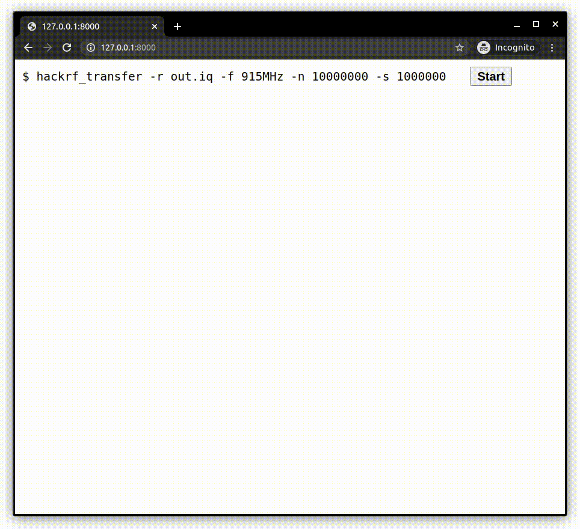

# webusb-libusb-shim

Experimental libusb-WebUSB shim to enable compiling 
libusb-based C-programs to Wasm, and have the USB 
logic "just work".

This is *experimental and incomplete*, but is sufficiently functional to build unmodified `libhackrf` and `hackrf_transfer` to Wasm, run it in a browser,
receive IQ to `MEMFS`, and download the resulting IQ file.



## prerequisites

* [Emscripten](https://emscripten.org/docs/getting_started/downloads.html#platform-notes-installation-instructions-sdk)
* Chrome-based browser (note that Ubuntu's Chromium Snap does not have access to USB devices)

## build and run

```
$ git clone https://github.com/marcnewlin/webusb-libusb-shim.git

$ cd webusb-libusb-shim

$ git submodule init && git submodule update

$ make -j

$ ./run-web-server.sh
```

Navigate to [http://127.0.0.1:8000/](http://127.0.0.1:8000/) in Chrome (or another compatible browser), and press `Start`.

## live demo

[https://marcnewlin.github.io/hackrf-libusb-webusb-shim-demo/](https://marcnewlin.github.io/hackrf-libusb-webusb-shim-demo/)

